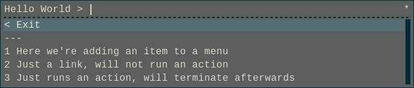
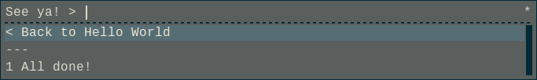

# Menumaker

**CURRENTLY IN DEVELOPMENT, API IS NOT STABLE**

`menumaker` is a bash script which runs menumaker scripts (specially formatted bash scripts)
and renders them as a series of interactive menus using
[rofi](https://davedavenport.github.io/rofi/).

## Motivation

`rofi` is a great selector, and some great scripts have already been written
which take advantage of rofi's features to make quick and easy-to-use menus
driven applications.
Some examples include:

- [rofi-scripts](https://github.com/carnager/rofi-scripts)
- [teiler](https://github.com/carnager/teiler)
- [rofi-pass](https://github.com/carnager/rofi-pass)
- [clerk](https://github.com/carnager/clerk)

`menumaker`'s entire purpose is to make these types of programs easy to create
and maintain.

# Getting Started

To start, download menumaker to your computer. Next, follow along with a couple
of examples:

## Example #1 - Hello World

First I'll show you the code, then I'll explain some basics about working with
`menumaker`.

```bash
#!/path/to/menumaker

#begin main
name="Hello World"
add_item "Here we're adding an item to a menu"            'next' 'echo Running the item'
add_link 'Just a link, will not run an action'            'next'
add_exec 'Just runs an action, will terminate afterwards'        'echo Running the exec'
#end main

#begin next
name="Final menu"
prompt="See ya! > "
add_exec 'All done!' "echo Thanks for playing, come again sometime"
#end next
```

Save that in a file, maybe `helloworld`, `chmod 700` it, then run with `./helloworld`.

### Output





There's a couple of things to notice right off the bat.

- `menumaker` auto generates "back" menu options, filling in the name of the menu where necessary.
- It also auto generates a prompt if a custom one is not provided, as in the main menu.
- All the echo statements work exactly like you would expect them to.
- Any menu options which are decorations, or nops, will not terminate the application, but will instead, just reload the same menu
- Each menu has a begin and end statement
- `menumaker` will always start at the main menu
- If you press rofi's quit button (default: ESC) at any time, the menu will terminate

# TODO

- Add examples about dynamic menu creation, managing state, and reading rofi's selection
- Check the [issue tracker](https://github.com/octotep/menumaker/issues)
